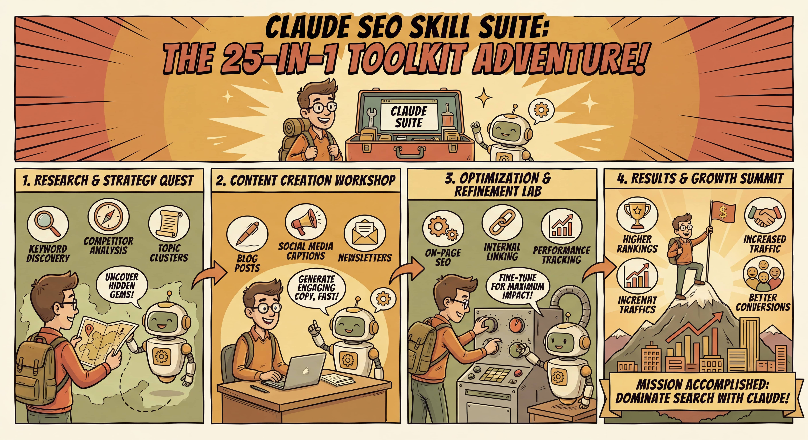

[English](README.md) | [中文](README_CN.md) | **日本語** | [한국어](README_KR.md)

# 🔍 claude-seo-skill

<div align="center">

**25-in-1 — 現時点で最も包括的な Claude SEO スキルスイート**

キーワード調査 · コンテンツ · テクニカル監査 · GEO/AI Overview · 被リンク · 順位トラッキング

*他の Claude SEO スキルがカバーするのは 1〜3 領域。このスイートは全領域をカバーします。*

[](https://github.com/leofankm/claude-seo-skill/stargazers)
[](https://github.com/leofankm/claude-seo-skill/releases)
[](LICENSE)
[](https://claude.ai/code)
[](#platforms)

[**ランディングページ**](https://clawpond.com/seo-skill) · [**ブログ記事**](https://clawpond.com/blog/claude-seo-skill-suite-25-in-1) · [**中文文档**](README_CN.md)



</div>

---

## なぜ 25-in-1 なのか？

市販の Claude SEO スキル（や GPTs）は、通常**一つのこと**しかできません — キーワード調査だけ、コンテンツ監査だけ、テクニカルチェックだけ。完全な SEO ワークフローをカバーするには、5〜7 個のツールが必要です。

**このスイートがすべてを置き換えます。** 25 の専門スキル、一つの統合された Claude コンテキスト：

- キーワード調査 → コンテンツブリーフ → テクニカル監査 → GEO 最適化 → 被リンク分析 → 順位モニタリング
- **GEO / AI Overview 最適化を内蔵**（他の Claude SEO スキルにはありません）
- Princeton KDD 2024 の学術研究に裏打ちされた GEO 戦略
- 80 ルールの包括的サイト監査
- Claude Code、OpenClaw、Cursor、Kiro に対応

> **他の SEO ツールはまだ AI Overview を無視しています** — Google AI Overview が従来の SEO トラフィックを 34〜46% 減少させているにもかかわらず。GEO を真剣に扱っている唯一のスキルスイートです。

```
Keywords → Content Brief → Technical Audit → GEO/AI Overview → Backlinks → Monitoring
   ↓              ↓               ↓                  ↓               ↓           ↓
seo-keyword   seo-content    seo-audit          seo-geo         seo-backlinks  seo-monitor
  -research    -brief        seo-technical      seo-schema       seo-competitor seo-rank
seo-competitor seo-content   seo-performance    seo-agent          -pages       -tracker
  -analysis    seo-geo        seo-sitemap        seo-images                    seo-report
seo-data-tools seo-schema    seo-hreflang       seo-page                      seo-multiplatform
               seo-images    seo-programmatic
```

---

## 25 スキル一覧

| # | スキル | 用途 | コマンド |
|---|--------|------|----------|
| 1 | `seo` | オーケストレーター — 24 のサブスキルに振り分け | `/seo <command>` |
| 2 | `seo-plan` | SEO 戦略策定と 12 か月ロードマップ | `/seo plan <domain>` |
| 3 | `seo-agent` | Agent Engine Optimization (AEO) | `/seo agent <url>` |
| 4 | `seo-keyword-research` | シードワード展開 → トピッククラスタ、検索意図分類 | `/seo keywords <topic>` |
| 5 | `seo-data-tools` | DataForSEO / GSC / GA4 API 連携 | `/seo data <query>` |
| 6 | `seo-competitor-analysis` | 競合キーワードギャップ、SWOT、SOV 分析 | `/seo competitors <domain>` |
| 7 | `seo-content-brief` | SERP データに基づくコンテンツブリーフとギャップ分析 | `/seo brief <keyword>` |
| 8 | `seo-content` | E-E-A-T スコアリング、薄いコンテンツの検出 | `/seo content <url>` |
| 9 | `seo-geo` | **GEO / AI Overview 最適化**（Princeton KDD 2024） | `/seo geo <url>` |
| 10 | `seo-schema` | 15 種類以上の Schema.org JSON-LD を自動生成 | `/seo schema <url>` |
| 11 | `seo-images` | 画像 SEO + Google Lens ビジュアル検索対応 | `/seo images <url>` |
| 12 | `seo-page` | 単一ページの詳細オンページ分析 | `/seo page <url>` |
| 13 | `seo-audit` | **7 カテゴリ 80 ルールのフルサイト監査** | `/seo audit <url>` |
| 14 | `seo-technical` | 8 カテゴリのテクニカル SEO 詳細診断 | `/seo technical <url>` |
| 15 | `seo-performance` | Core Web Vitals: LCP, INP, CLS 分析 | `/seo performance <url>` |
| 16 | `seo-sitemap` | XML サイトマップ監査と生成 | `/seo sitemap <url>` |
| 17 | `seo-hreflang` | 多言語 SEO / hreflang バリデーション | `/seo hreflang <url>` |
| 18 | `seo-backlinks` | 被リンク分析 + 競合リンクギャップ | `/seo backlinks <domain>` |
| 19 | `seo-competitor-pages` | SEO 最適化済み比較ページの自動生成 | `/seo vs <url1> <url2>` |
| 20 | `seo-monitor` | インテリジェント SEO アラートシステム | `/seo monitor <domain>` |
| 21 | `seo-rank-tracker` | 検索順位 + SERP 機能トラッキング | `/seo rank <keyword>` |
| 22 | `seo-report` | 週次・月次・四半期レポートの自動生成 | `/seo report <domain>` |
| 23 | `seo-multiplatform` | TikTok / YouTube / Reddit 向け SEO | `/seo multiplatform <brand>` |
| 24 | `seo-programmatic` | プログラマティック SEO 計画 | `/seo programmatic <niche>` |
| 25 | `seo-local` | ローカル SEO + Google Business Profile | `/seo local <business>` |

---

## GEO / AI Overview — 他にはない機能

> **Google AI Overview が検索結果の最上部を占拠。従来の SEO トラフィックは 34〜46% 減少しています。** ほとんどの SEO ツールはこの現実から目を逸らしています。

体系的な GEO 対応を備えた**唯一の** Claude スキルスイートです。査読済み学術研究に裏打ちされています。

**Princeton 大学 KDD 2024 — 9 つの GEO 最適化戦略**（Aggarwal et al.）:

| 戦略 | AI 引用率の変化 | 難易度 |
|------|----------------|--------|
| 出典の明記 | **+30〜40%** | 低 |
| 統計データの追加 | **+25〜35%** | 低 |
| 専門家の引用 | +20〜30% | 中 |
| 文章の流暢さ最適化 | +15〜25% | 低 |
| 表現の簡潔化 | +10〜20% | 低 |
| コンテンツの構造化 | +10〜20% | 低 |
| マルチモーダルコンテンツ | +15〜25% | 高 |
| 専門用語の追加 | +5〜15% | 中 |
| キーワード詰め込み ❌ | −15〜25% | 非推奨 |

**GEO スコア算出式**（`seo-geo/SKILL.md` より）:
```
GEO Score = (Citability × 0.25) + (Structure × 0.20) + (Authority × 0.20)
          + (Multi-Modal × 0.15) + (Technical × 0.20)
```

**seo-geo の主な機能:**
- AI Overview トリガー条件の検出
- Perplexity / ChatGPT Search での表示状況分析
- AI クローラー向け `llms.txt` の生成
- GEO 最適化コンテンツのリライト提案
- AI Overview における競合トラッキング

---

## クイックインストール

### 方法 1: OpenClaw Skill Marketplace（推奨）
```bash
claw install seo-suite
```

### 方法 2: 手動インストール（スキルファイルのコピー）
```bash
git clone https://github.com/leofankm/claude-seo-skill
cd claude-seo-skill

# スキルをコピー
cp -r skills/seo* ~/.claude/skills/

# エージェントをコピー
cp -r agents/seo* ~/.claude/agents/
```

### 方法 3: ワンラインインストールスクリプト
```bash
curl -sSL https://raw.githubusercontent.com/leofankm/claude-seo-skill/main/install.sh | bash
```

---

## 使い方

### 初回実行（推奨手順）
```bash
# 1. サイト全体のヘルスチェック — 10 分で現状を把握
/seo audit https://yoursite.com

# 2. キーワード調査 — 最優先ターゲットを見つける
/seo keywords "your core topic"

# 3. コンテンツブリーフ — 実際の SERP データに基づくライター向けブリーフ
/seo brief "target keyword"

# 4. GEO チェック — AI 検索での表示状況を確認し、優先的に改善
/seo geo https://your-important-page.com
```

### オーケストレーターコマンド
```bash
/seo audit <url>              # フルサイト監査（80 ルール、7 カテゴリ）
/seo keywords <topic>         # キーワード調査 → トピッククラスタ → 優先順位リスト
/seo brief <keyword>          # SERP ベースのコンテンツブリーフ
/seo geo <url>                # GEO / AI Overview 最適化
/seo competitors <domain>     # 競合 SEO 分析 + SWOT
/seo technical <url>          # テクニカル SEO（8 カテゴリ）
/seo performance <url>        # Core Web Vitals 分析
/seo backlinks <domain>       # 被リンク分析 + ギャップ発見
/seo rank <keyword>           # 検索順位 + SERP 機能トラッキング
/seo local <business>         # ローカル SEO + GBP 最適化
/seo report <domain>          # SEO レポート自動生成
```

### ステージ別スキルの組み合わせ

| ステージ | スキル | 最適な用途 |
|----------|--------|-----------|
| **スタート** | audit + keyword-research + content-brief | 個人サイト、初心者向け |
| **グロース** | + geo + technical + backlinks + rank-tracker | 成長中のプロダクト、コンテンツサイト |
| **フルスタック** | 全 25 スキル | プロ SEO チーム、エージェンシー |

---

## 実践シナリオ

| シナリオ | スイートなし | スイートあり |
|----------|-------------|-------------|
| キーワード調査 | Ahrefs からエクスポート → スプレッドシートにコピー → 手動で意図を判定 | `/seo keywords "topic"` → クラスタ + 優先順位リスト、ワンステップで完了 |
| コンテンツブリーフ | 上位 10 件の競合を手動分析、2〜4 時間 | `/seo brief "keyword"` → ギャップ分析付きブリーフ、15 分 |
| テクニカル監査 | Screaming Frog + 手動チェックリスト | `/seo audit <url>` → 修正コード付き 80 ルールレポート |
| AI での表示確認 | 適切なツールが存在しない | `/seo geo <url>` → GEO スコア + AI Overview トリガー + リライト提案 |
| 競合分析 | 3 つ以上のツールを切り替え、半日がかり | `/seo competitors <domain>` → キーワードギャップ + SWOT + クイックウィン |
| 月次レポート | GSC + GA4 + Ahrefs から手動集計、4〜8 時間 | `/seo report <domain>` → インサイト付き自動集計、1 時間 |

---

## 監査ルール（80 のコアルール）

`seo-audit` スキルには 7 カテゴリ 80 ルールが含まれます:

| カテゴリ | ルール数 | 例 |
|----------|---------|-----|
| **Core SEO** (CS01–CS15) | 15 | タイトルタグ、H1、URL 構造、canonical |
| **Performance** (PF01–PF12) | 12 | LCP, INP, CLS, TTFB, リソース圧縮 |
| **Links** (LK01–LK12) | 12 | 内部リンク密度、リンク切れ、リダイレクトチェーン |
| **Images** (IM01–IM10) | 10 | alt テキスト、圧縮、遅延読み込み、フォーマット |
| **Security** (SC01–SC10) | 10 | HTTPS, HSTS, CSP, mixed content |
| **AI/GEO Readiness** (AI01–AI10) | 10 | llms.txt, Perplexity 表示、構造化 FAQ |
| **Content Quality** (CQ01–CQ11) | 11 | E-E-A-T, 薄いコンテンツ、重複コンテンツ |

---

## リポジトリ構成

```
claude-seo-skill/
├── README.md                    ← English
├── README_CN.md                 ← 中文文档
├── README_JA.md                 ← このファイル
├── LICENSE                      ← MIT
├── CHANGELOG.md                 ← バージョン履歴
├── install.sh                   ← ワンラインインストーラー
├── skills/
│   ├── seo/SKILL.md             ← オーケストレーター（24 サブスキルを振り分け）
│   ├── seo-audit/SKILL.md       ← 80 ルールのフルサイト監査
│   ├── seo-keyword-research/    ← キーワード調査手法
│   ├── seo-competitor-analysis/ ← 競合分析フレームワーク
│   ├── seo-geo/SKILL.md         ← GEO / AI Overview 最適化
│   ├── seo-local/SKILL.md       ← ローカル SEO + GBP
│   └── ... (全 25 スキルディレクトリ)
├── agents/
│   └── seo*.md                  ← 27 の専門 Claude エージェント
└── references/
    ├── eeat-framework.md        ← E-E-A-T スコアリングフレームワーク
    ├── keyword-difficulty.md    ← KD スコアと業界ベンチマーク
    ├── cwv-thresholds.md        ← Core Web Vitals 閾値
    ├── schema-types.md          ← Schema.org タイプリファレンス
    ├── backlink-metrics.md      ← 被リンク品質指標
    ├── quality-gates.md         ← コンテンツ品質ゲート
    ├── mcp-quality.md           ← MCP サーバー品質基準
    ├── openapi-compliance.md    ← OpenAPI 準拠リファレンス
    └── agent-user-agents.md     ← AI クローラー User-Agent 一覧
```

---

## 対応プラットフォーム

Claude Code 互換環境であれば利用可能です:

| プラットフォーム | 状況 | 備考 |
|-----------------|------|------|
| **Claude Code** | ✅ 完全対応 | `~/.claude/skills/` にコピー |
| **OpenClaw** | ✅ 完全対応 | `claw install seo-suite` |
| **Cursor** | ✅ 完全対応 | `.cursor/skills/` にコピー |
| **Kiro** | ✅ 完全対応 | `.kiro/skills/` にコピー |
| **OpenCode** | ✅ 完全対応 | skills ディレクトリにコピー |

---

## バージョン履歴

| バージョン | 更新内容 |
|-----------|---------|
| **v4.0** | +seo-keyword-research, +seo-competitor-analysis, +seo-local を追加。seo-audit に 80 監査ルールを搭載。seo-geo に Princeton KDD 2024 GEO 研究データを統合。keyword-difficulty.md リファレンスを追加 |
| v3.0 | +seo-geo (AI Overview), +seo-agent (AEO), +seo-multiplatform, +seo-programmatic, +seo-local |
| v2.0 | +seo-rank-tracker, +seo-monitor, +seo-report, +seo-data-tools。リファレンスファイル 9 件 |
| v1.0 | コアスキル 15 種: audit, technical, performance, content, schema, images, page, backlinks, sitemap, hreflang, competitor-pages, content-brief, plan, visual |

---

## コントリビューション

25 スキルファイルはすべてプレーンな Markdown です — ビルドステップは不要です。

1. このリポジトリを Fork
2. `skills/*/SKILL.md` または `agents/*.md` を編集
3. 変更内容・理由・可能であればテストケースを添えて PR を提出

**特に歓迎する貢献:**
- 効果測定データ付きの新しい GEO 戦略
- 新しい SERP 機能トラッキング手法（AI Overview は急速に変化しています）
- 業界特化の SEO ルールセット（EC、SaaS、ローカル、メディア）
- 新しい AI 検索エンジンへの対応（Perplexity, ChatGPT Search, Gemini）

---

## コミュニティ

<div align="center">

SEO × AI 実践者コミュニティにご参加ください

| 中国語コミュニティ | 英語コミュニティ |
|:-----------------:|:-----------------:|
|  |  |
| 中文交流群 | English Group |
| SEO 実践 + スキル議論 | GEO research + skill updates |

※ WeChat グループは主に中国語話者向けのコミュニティです。英語グループもご利用いただけます。

**コミュニティでの週次コンテンツ:**
- 🔍 データ付き実サイト SEO 事例
- 📊 GEO 研究: AI Overview ルール変更
- 🛠 スキルアップデートのお知らせ
- 💬 Q&A: 戦略 + スキル活用法

</div>

---

## 引用

本スキルスイートの GEO 研究データを利用する場合は、以下を引用してください:

```bibtex
@inproceedings{aggarwal2024geo,
  title     = {GEO: Generative Engine Optimization},
  author    = {Aggarwal, Pranjal and Mündler, Niels and others},
  booktitle = {Proceedings of the 30th ACM SIGKDD Conference on Knowledge Discovery and Data Mining},
  year      = {2024},
  publisher = {ACM}
}
```

---

## ライセンス

MIT © [OpenClaw](https://clawpond.com)

自由に利用し、コミュニティに還元し、優れた SEO ワークフローを構築しましょう。

---

<div align="center">
  <sub>Built by <a href="https://clawpond.com">OpenClaw</a> · <a href="https://clawpond.com/seo-skill">Landing Page</a> · <a href="https://clawpond.com/blog/claude-seo-skill-suite-25-in-1">Blog Post</a></sub>
</div>
